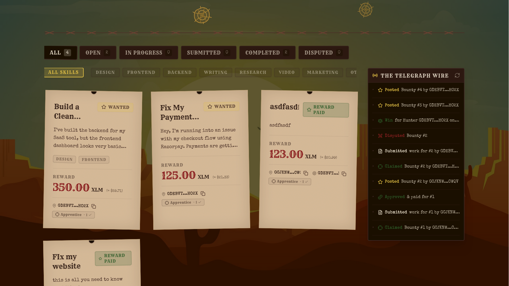

# SkillBounty - Trustless bounty board on Stellar Soroban

Decentralised freelance escrow on Stellar Testnet. Posters lock XLM into a Soroban contract; hunters claim, submit work, and funds release on approval — or an on-chain arbitrator resolves disputes. Built with Next.js 14, Freighter wallet, and Tailwind CSS.

**Live demo:** https://skillbounty.pathakom.dev/
**Video demo:** https://bit.ly/4tjeT1C





---

## Features

- **On-chain escrow** — XLM locks into the contract at post time, released only on approval or arbitration
- **Zero platform fee** — funds go directly from contract to helper, no cut taken
- **Auto-release** — poster doesn't respond by deadline? Contract pays the hunter automatically
- **Exclusive claim** — bounty locks to one hunter; no delivery = no payout
- **On-chain arbitration** — disputes resolved by a hardcoded Sheriff address, enforced by the contract
- **Verifiable reputation** — scores written on-chain per wallet, no platform can fake or reset them

---

## Tech stack

Next.js 14 (App Router) · Stellar Testnet + Soroban · Freighter wallet · Tailwind CSS · Lucide React · Jest + ts-jest

---

## Getting started

```bash
git clone https://github.com/your-username/SkillBounty.git
cd SkillBounty
npm install
```

Create `.env.local`:

```env
NEXT_PUBLIC_STELLAR_NETWORK=TESTNET
NEXT_PUBLIC_HORIZON_URL=https://horizon-testnet.stellar.org
NEXT_PUBLIC_SOROBAN_RPC_URL=https://soroban-testnet.stellar.org
NEXT_PUBLIC_CONTRACT_ADDRESS=<your_deployed_contract_address>
NEXT_PUBLIC_ARBITRATOR_ADDRESS=<arbitrator_stellar_address>
```

```bash
npm run dev
```

---

## Tests

```bash
npm test
```

```
 PASS  src/__tests__/skillbounty.test.ts
  stroopsToXlm
    ✓ converts 10_000_000 stroops to "1.00" XLM (1 ms)
    ✓ converts 0 stroops to "0.00" (1 ms)
    ✓ converts 50_000_000 stroops to "5.00"
    ✓ converts 1 stroops to "0.00" (below 2 decimal precision)
    ✓ converts 100_000 stroops to "0.01" XLM
    ✓ converts 1_500_000_000 stroops to "150.00" XLM
  xlmToStroops
    ✓ converts 1 XLM to 10_000_000 stroops
    ✓ converts 0 XLM to 0 stroops
    ✓ converts 5.5 XLM to 55_000_000 stroops
    ✓ result is always a bigint
    ✓ round-trip: stroopsToXlm(xlmToStroops(x)) === x for whole numbers (1 ms)
  truncateAddress
    ✓ default truncation keeps 6 start + 4 end chars with ellipsis
    ✓ custom chars=12 keeps 12 start + 4 end
    ✓ returns empty string for empty input
    ✓ always contains "..." separator
  STROOPS_PER_XLM
    ✓ is exactly 10_000_000n
    ✓ is a BigInt
  BountyStatus enum values
    ✓ Open status is defined
    ✓ InProgress status is defined
    ✓ Submitted status is defined (1 ms)
    ✓ Completed status is defined
    ✓ Disputed status is defined
    ✓ Refunded status is defined
    ✓ all statuses are distinct values

Tests: 24 passed, 24 total
```

---

## Smart contract

Source: [`contract/`](./contract/)

| Function | Description |
|---|---|
| `post_bounty` | Create bounty, lock XLM into escrow |
| `claim_bounty` | Hunter claims an open bounty |
| `submit_work` | Hunter submits work URL |
| `approve_work` | Poster releases funds to hunter |
| `dispute_work` | Poster raises a dispute |
| `arbitrate` | Arbitrator rules for hunter or refunds poster |
| `get_all_bounties` | Read all bounties |
| `get_reputation` | Get reputation score for an address |

Contract address (Testnet): `<your_contract_address>`

---

## Project structure

```
src/
├── app/
│   ├── page.tsx
│   ├── bounty/[id]/
│   ├── post/
│   ├── profile/[address]/
│   └── leaderboard/
├── components/
│   ├── Navbar.tsx
│   ├── BountyList.tsx
│   ├── BountyCard.tsx
│   ├── ArbitrationPanel.tsx
│   └── ActivityFeed.tsx
├── lib/
│   ├── contract.ts
│   └── constants.ts
└── __tests__/
    └── skillbounty.test.ts
assets/
└── wallpaper.jpg
```

---

## License

MIT
