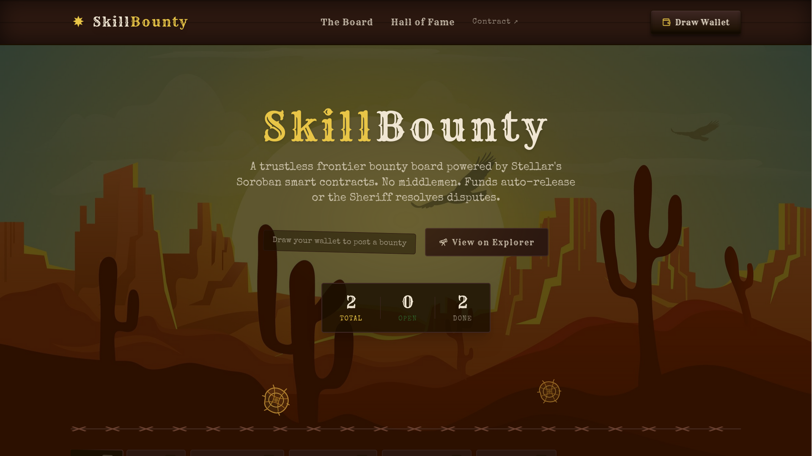
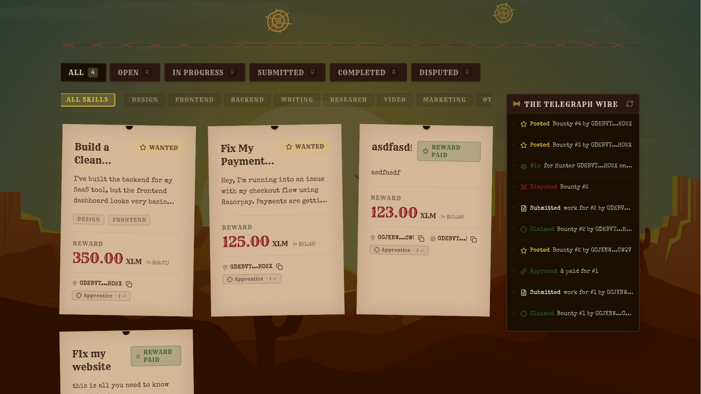
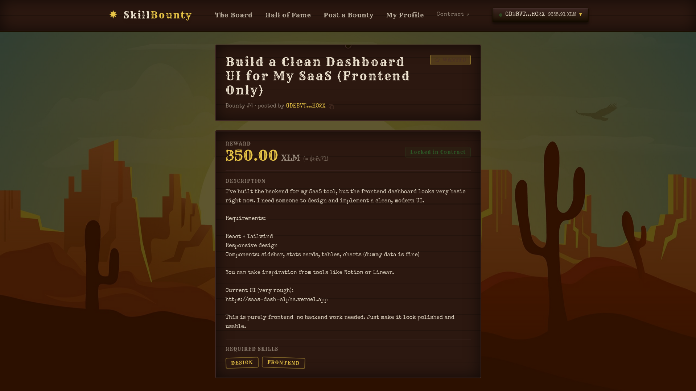

# SkillBounty — Trustless bounty board on Stellar Soroban

Decentralised freelance escrow on Stellar Testnet. Posters lock XLM into a Soroban contract; hunters claim, submit work, and funds release on approval — or an on-chain arbitrator resolves disputes. Built with Next.js 14, Freighter wallet, and Tailwind CSS.

[](https://github.com/Gamferno/skillbounty/actions/workflows/ci.yml)

**Live demo:** https://skillbounty.pathakom.dev  
**Video demo:** https://bit.ly/4tjeT1C






---

## Features

- **On-chain escrow** — XLM locks into the contract at post time, released only on approval or arbitration
- **Zero platform fee** — funds go directly from contract to helper, no cut taken
- **Auto-release** — poster doesn't respond by deadline? Contract pays the hunter automatically
- **Exclusive claim** — bounty locks to one hunter; no delivery = no payout
- **On-chain arbitration** — disputes resolved by a hardcoded Sheriff address, enforced by the contract
- **Verifiable reputation** — scores written on-chain per wallet, no platform can fake or reset them

---

## Tech stack

Next.js 14 (App Router) · Stellar Testnet + Soroban · Freighter wallet · Tailwind CSS · Lucide React · Jest + ts-jest

---

## Getting started

```bash
git clone https://github.com/Gamferno/skillbounty.git
cd skillbounty
npm install
```

Create `.env.local`:

```env
NEXT_PUBLIC_STELLAR_NETWORK=TESTNET
NEXT_PUBLIC_HORIZON_URL=https://horizon-testnet.stellar.org
NEXT_PUBLIC_SOROBAN_RPC_URL=https://soroban-testnet.stellar.org
NEXT_PUBLIC_CONTRACT_ADDRESS=CBLVYIF776MUZLQXUWJOFWS3LBYGVZXSQSJUNHB2M66Q6J26Q5XSELHA
NEXT_PUBLIC_ARBITRATOR_ADDRESS=GDEBVTOA3BOWI7PNO3SBTJDRB2W3SV4AEFRHXTHWZP7R76I2WAZRHO2X
```

```bash
npm run dev
```

---

## Mobile responsive

The UI uses Tailwind CSS responsive utilities (`sm:`, `md:`, `lg:`) throughout. All pages — bounty board, bounty detail, post, profile, and leaderboard — are fully usable on mobile viewports.


---

## CI/CD pipeline

GitHub Actions runs on every push and pull request to `main`:

| Job | Steps |
|---|---|
| **Frontend** | `npm ci` → `npm run lint` → `npm test` → `npm run build` |
| **Contract** | Install Rust + `wasm32` target → `cargo test --locked` |

[](https://github.com/Gamferno/skillbounty/actions/workflows/ci.yml)

Workflow file: [`.github/workflows/ci.yml`](.github/workflows/ci.yml)

---

## Tests

```bash
npm test
```

```
 PASS  src/__tests__/skillbounty.test.ts
  stroopsToXlm
    ✓ converts 10_000_000 stroops to "1.00" XLM (1 ms)
    ✓ converts 0 stroops to "0.00" (1 ms)
    ✓ converts 50_000_000 stroops to "5.00"
    ✓ converts 1 stroops to "0.00" (below 2 decimal precision)
    ✓ converts 100_000 stroops to "0.01" XLM
    ✓ converts 1_500_000_000 stroops to "150.00" XLM
  xlmToStroops
    ✓ converts 1 XLM to 10_000_000 stroops
    ✓ converts 0 XLM to 0 stroops
    ✓ converts 5.5 XLM to 55_000_000 stroops
    ✓ result is always a bigint
    ✓ round-trip: stroopsToXlm(xlmToStroops(x)) === x for whole numbers (1 ms)
  truncateAddress
    ✓ default truncation keeps 6 start + 4 end chars with ellipsis
    ✓ custom chars=12 keeps 12 start + 4 end
    ✓ returns empty string for empty input
    ✓ always contains "..." separator
  STROOPS_PER_XLM
    ✓ is exactly 10_000_000n
    ✓ is a BigInt
  BountyStatus enum values
    ✓ Open status is defined
    ✓ InProgress status is defined
    ✓ Submitted status is defined (1 ms)
    ✓ Completed status is defined
    ✓ Disputed status is defined
    ✓ Refunded status is defined
    ✓ all statuses are distinct values

Tests: 24 passed, 24 total
```

---

## Smart contract

Source: [`contract/`](./contract/)

| Function | Description |
|---|---|
| `initialize` | One-time setup: set arbitrator wallet + native XLM token address |
| `post_bounty` | Create bounty, lock XLM into escrow |
| `claim_bounty` | Hunter claims an open bounty |
| `submit_work` | Hunter submits work URL |
| `approve_work` | Poster releases funds to hunter |
| `dispute_work` | Poster raises a dispute |
| `claim_timeout` | Anyone triggers auto-release after review deadline passes |
| `arbitrate` | Arbitrator rules for hunter or refunds poster |
| `get_all_bounties` | Read all bounties |
| `get_reputation` | Get reputation score for an address |

### Contract addresses (Stellar Testnet)

| Item | Address / Hash |
|---|---|
| **SkillBounty contract** | `CBLVYIF776MUZLQXUWJOFWS3LBYGVZXSQSJUNHB2M66Q6J26Q5XSELHA` |
| **Deployment tx hash** | `38261bd09338cf9e46d41ef7aa3cdf93df2c542ac92f393b10926e35da28de9e` |
| **Native XLM token (SAC)** | `CDLZFC3SYJYDZT7K67VZ75HPJVIEUVNIXF47ZG2FB2RMQQVU2HHGCYSC` |
| **Arbitrator (Sheriff) wallet** | `GDEBVTOA3BOWI7PNO3SBTJDRB2W3SV4AEFRHXTHWZP7R76I2WAZRHO2X` |

Explorer links:
- [Contract on stellar.expert](https://stellar.expert/explorer/testnet/contract/CBLVYIF776MUZLQXUWJOFWS3LBYGVZXSQSJUNHB2M66Q6J26Q5XSELHA)
- [Deployment tx on stellar.expert](https://stellar.expert/explorer/testnet/tx/38261bd09338cf9e46d41ef7aa3cdf93df2c542ac92f393b10926e35da28de9e)

### Inter-contract call

`post_bounty` and `approve_work` / `arbitrate` each make a cross-contract call into the **native XLM Stellar Asset Contract (SAC)** via the Soroban `token::Client`:

```rust
// post_bounty — lock funds into escrow (SkillBounty → XLM SAC)
let native_token = token::Client::new(&env, &get_native_token(&env));
native_token.transfer(&poster, &contract_address, &reward);

// approve_work / arbitrate — release funds from escrow (SkillBounty → XLM SAC)
native_token.transfer(&env.current_contract_address(), recipient, &amount);
```

Every bounty post and payout is a live inter-contract call: **SkillBounty contract → XLM SAC** (`CDLZFC3SYJYDZT7K67VZ75HPJVIEUVNIXF47ZG2FB2RMQQVU2HHGCYSC`).

---

## Deploying to Vercel

1. Push this repo to GitHub (public)
2. Go to [vercel.com/new](https://vercel.com/new) → **Import** `Gamferno/skillbounty`
3. Framework: **Next.js** (auto-detected)
4. Add environment variables:

| Key | Value |
|---|---|
| `NEXT_PUBLIC_STELLAR_NETWORK` | `TESTNET` |
| `NEXT_PUBLIC_HORIZON_URL` | `https://horizon-testnet.stellar.org` |
| `NEXT_PUBLIC_SOROBAN_RPC_URL` | `https://soroban-testnet.stellar.org` |
| `NEXT_PUBLIC_CONTRACT_ADDRESS` | `CBLVYIF776MUZLQXUWJOFWS3LBYGVZXSQSJUNHB2M66Q6J26Q5XSELHA` |
| `NEXT_PUBLIC_ARBITRATOR_ADDRESS` | `GDEBVTOA3BOWI7PNO3SBTJDRB2W3SV4AEFRHXTHWZP7R76I2WAZRHO2X` |

5. Click **Deploy** — Vercel auto-builds and assigns your domain

---

## Project structure

```
src/
├── app/
│   ├── page.tsx
│   ├── bounty/[id]/
│   ├── post/
│   ├── profile/[address]/
│   └── leaderboard/
├── components/
│   ├── Navbar.tsx
│   ├── BountyList.tsx
│   ├── BountyCard.tsx
│   ├── ArbitrationPanel.tsx
│   └── ActivityFeed.tsx
├── lib/
│   ├── contract.ts
│   └── constants.ts
└── __tests__/
    └── skillbounty.test.ts
contract/
├── src/
│   ├── lib.rs        ← main contract
│   ├── bounty.rs     ← data types
│   ├── storage.rs    ← on-chain storage helpers
│   └── test.rs       ← Soroban unit tests
assets/
├── homepage.png
├── bounty_board.png
├── bounty.png
├── hall_of_fame.png
└── mobile_screenshot.png
```

---

## License

MIT
